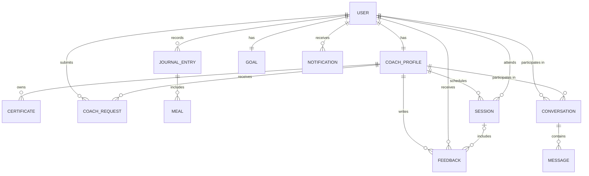

## 1. Schéma Relationnel

```mermaid
erDiagram
    USER ||--|| COACH_PROFILE : "has"
    COACH_PROFILE ||--o{ CERTIFICATE : "owns"
    USER ||--o{ COACH_REQUEST : "submits"
    COACH_PROFILE ||--o{ COACH_REQUEST : "receives"
    USER ||--o{ JOURNAL_ENTRY : "records"
    JOURNAL_ENTRY ||--o{ MEAL : "includes"
    USER ||--|| GOAL : "has"
    COACH_PROFILE ||--o{ SESSION : "schedules"
    USER ||--o{ SESSION : "attends"
    USER ||--o{ CONVERSATION : "participates in"
    COACH_PROFILE ||--o{ CONVERSATION : "participates in"
    CONVERSATION ||--o{ MESSAGE : "contains"
    USER ||--o{ NOTIFICATION : "receives"
    COACH_PROFILE ||--o{ FEEDBACK : "writes"
    USER ||--o{ FEEDBACK : "receives"
    SESSION |o--o{ FEEDBACK : "includes"
```