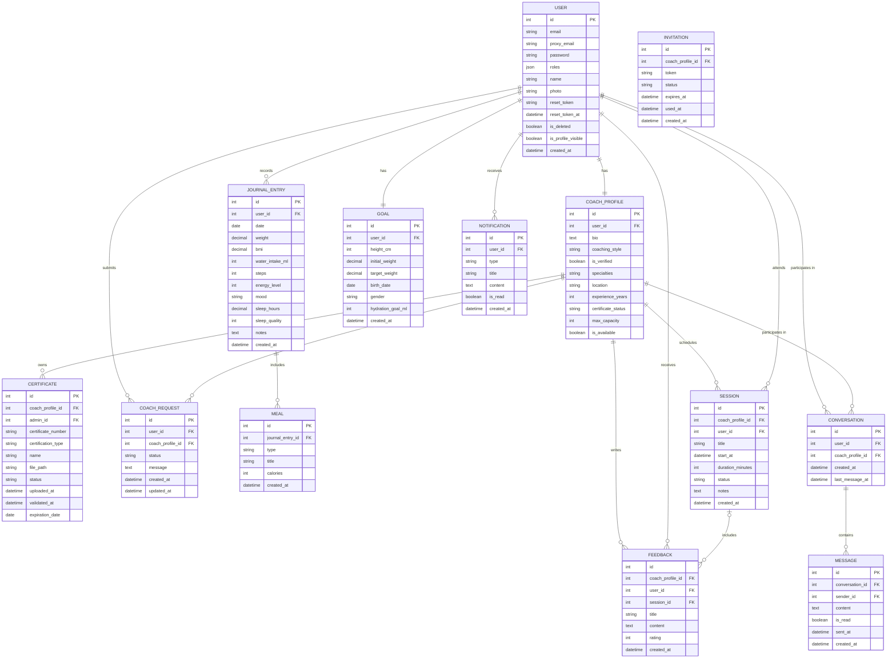

# Schéma- Modèle Logique de Données (MLD)

```mermaid
erDiagram

    USER ||--|| COACH_PROFILE : "has"
    COACH_PROFILE ||--o{ CERTIFICATE : "owns"
    USER ||--o{ COACH_REQUEST : "submits"
    COACH_PROFILE ||--o{ COACH_REQUEST : "receives"
    USER ||--o{ JOURNAL_ENTRY : "records"
    JOURNAL_ENTRY ||--o{ MEAL : "includes"
    USER ||--|| GOAL : "has"
    COACH_PROFILE ||--o{ SESSION : "schedules"
    USER ||--o{ SESSION : "attends"
    USER ||--o{ CONVERSATION : "participates in"
    COACH_PROFILE ||--o{ CONVERSATION : "participates in"
    CONVERSATION ||--o{ MESSAGE : "contains"
    USER ||--o{ NOTIFICATION : "receives"
    COACH_PROFILE ||--o{ FEEDBACK : "writes"
    USER ||--o{ FEEDBACK : "receives"
    SESSION |o--o{ FEEDBACK : "includes"

    USER {
        int id PK
        string email
        string proxy_email
        string password
        json roles
        string name
        string photo
        string reset_token
        datetime reset_token_at
        boolean is_deleted
        boolean is_profile_visible
        datetime created_at
    }

    COACH_PROFILE {
        int id PK
        int user_id FK
        text bio
        string coaching_style
        boolean is_verified
        string specialties
        string location
        int experience_years
        string certificate_status
        int max_capacity
        boolean is_available
    }

    CERTIFICATE {
        int id PK
        int coach_profile_id FK
        int admin_id FK
        string certificate_number
        string certification_type
        string name
        string file_path
        string status
        datetime uploaded_at
        datetime validated_at
        date expiration_date
    }

    COACH_REQUEST {
        int id PK
        int user_id FK
        int coach_profile_id FK
        string status
        text message
        datetime created_at
        datetime updated_at
    }

    JOURNAL_ENTRY {
        int id PK
        int user_id FK
        date date
        decimal weight
        decimal bmi
        int water_intake_ml
        int steps
        int energy_level
        string mood
        decimal sleep_hours
        int sleep_quality
        text notes
        datetime created_at
    }

    MEAL {
        int id PK
        int journal_entry_id FK
        string type
        string title
        int calories
        datetime created_at
    }

    GOAL {
        int id PK
        int user_id FK
        int height_cm
        decimal initial_weight
        decimal target_weight
        date birth_date
        string gender
        int hydration_goal_ml
        datetime created_at
    }

    SESSION {
        int id PK
        int coach_profile_id FK
        int user_id FK
        string title
        datetime start_at
        int duration_minutes
        string status
        text notes
        datetime created_at
    }

    CONVERSATION {
        int id PK
        int user_id FK
        int coach_profile_id FK
        datetime created_at
        datetime last_message_at
    }

    MESSAGE {
        int id PK
        int conversation_id FK
        int sender_id FK
        text content
        boolean is_read
        datetime sent_at
        datetime created_at
    }

    NOTIFICATION {
        int id PK
        int user_id FK
        string type
        string title
        text content
        boolean is_read
        datetime created_at
    }

    FEEDBACK {
        int id
        int coach_profile_id FK 
        int user_id FK 
        int session_id FK 
        string title
        text content
        int rating
        datetime created_at
    }

    INVITATION {
        int id PK
        int coach_profile_id FK
        string token
        string status
        datetime expires_at
        datetime used_at
        datetime created_at
    }
```