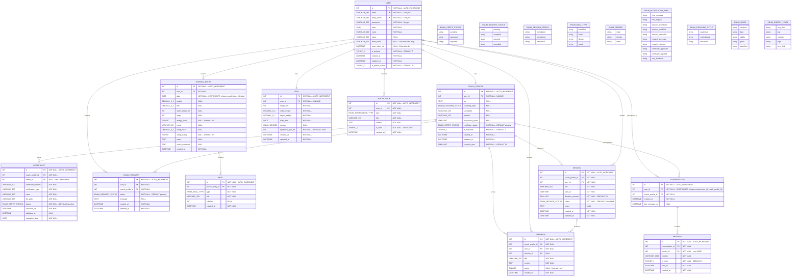

# Schéma- Modèle Physique de Données (MPD)

```mermaid
erDiagram
    USER ||--|| COACH_PROFILE : "has"
    COACH_PROFILE ||--o{ CERTIFICATE : "owns"
    USER ||--o{ COACH_REQUEST : "submits"
    COACH_PROFILE ||--o{ COACH_REQUEST : "receives"
    USER ||--o{ JOURNAL_ENTRY : "records"
    JOURNAL_ENTRY ||--o{ MEAL : "includes"
    USER ||--|| GOAL : "has"
    COACH_PROFILE ||--o{ SESSION : "schedules"
    USER ||--o{ SESSION : "attends"
    USER ||--o{ CONVERSATION : "participates in"
    COACH_PROFILE ||--o{ CONVERSATION : "participates in"
    CONVERSATION ||--o{ MESSAGE : "contains"
    USER ||--o{ NOTIFICATION : "receives"
    COACH_PROFILE ||--o{ FEEDBACK : "writes"
    USER ||--o{ FEEDBACK : "receives"
    SESSION |o--o{ FEEDBACK : "includes"

    USER {
        INT id PK "NOT NULL - AUTO_INCREMENT"
        VARCHAR_180 email UK "NOT NULL - UNIQUE"
        VARCHAR_180 proxy_email UK "NOT NULL - UNIQUE"
        VARCHAR_255 password "NOT NULL - Bcrypt"
        JSON roles "NOT NULL"
        VARCHAR_100 name "NOT NULL"
        VARCHAR_255 photo "NULL"
        VARCHAR_255 reset_token "NULL - Securite oubli mdp"
        DATETIME reset_token_at "NULL - Expiration 1h"
        TINYINT_1 is_deleted "NOT NULL - DEFAULT 0"
        DATETIME created_at "NOT NULL"
        DATETIME updated_at "NOT NULL"
        TINYINT_1 is_profile_visible "NOT NULL - DEFAULT 1"
    }

    COACH_PROFILE {
        INT id PK "NOT NULL - AUTO_INCREMENT"
        INT user_id FK "NOT NULL - UNIQUE"
        TEXT bio "NULL"
        ENUM_COACHING_STYLE coaching_style "NULL"
        VARCHAR_150 specialties "NULL"
        VARCHAR_150 location "NULL"
        SMALLINT experience_years "NULL"
        ENUM_CERTIF_STATUS certificate_status "NOT NULL - DEFAULT pending"
        TINYINT_1 is_available "NOT NULL - DEFAULT 0"
        DATETIME created_at "NOT NULL"
        DATETIME updated_at "NOT NULL"
        SMALLINT capacite_max "NOT NULL - DEFAULT 15"
    }

    CERTIFICATE {
        INT id PK "NOT NULL - AUTO_INCREMENT"
        INT coach_profile_id FK "NOT NULL"
        INT admin_id FK "NULL - vers USER admin"
        VARCHAR_100 certificate_number "NOT NULL"
        VARCHAR_100 certification_type "NOT NULL"
        VARCHAR_150 name "NOT NULL"
        VARCHAR_255 file_path "NOT NULL"
        ENUM_CERTIF_STATUS status "NOT NULL - DEFAULT pending"
        DATETIME uploaded_at "NOT NULL"
        DATETIME validated_at "NULL"
        DATE expiration_date "NOT NULL"
    }

    COACH_REQUEST {
        INT id PK "NOT NULL - AUTO_INCREMENT"
        INT user_id FK "NOT NULL"
        INT coach_profile_id FK "NOT NULL"
        ENUM_REQUEST_STATUS status "NOT NULL - DEFAULT pending"
        TEXT message "NULL"
        DATETIME created_at "NOT NULL"
        DATETIME updated_at "NOT NULL"
    }

    JOURNAL_ENTRY {
        INT id PK "NOT NULL - AUTO_INCREMENT"
        INT user_id FK "NOT NULL"
        DATE date "NOT NULL - CONTRAINTE: Unique couple (user_id, date)"
        DECIMAL_5_2 weight "NULL"
        DECIMAL_4_2 bmi "NULL"
        INT water_intake_ml "NULL"
        INT steps "NULL"
        TINYINT energy_level "NULL - Echelle 1 a 5"
        VARCHAR_20 mood "NULL"
        DECIMAL_4_2 sleep_hours "NULL"
        TINYINT sleep_quality "NULL - Echelle 1 a 5"
        TEXT notes "NULL"
        TEXT coach_comment "NULL"
        DATETIME created_at "NOT NULL"
    }

    MEAL {
        INT id PK "NOT NULL - AUTO_INCREMENT"
        INT journal_entry_id FK "NOT NULL"
        ENUM_MEAL_TYPE type "NOT NULL"
        VARCHAR_150 title "NOT NULL"
        INT calories "NULL"
        DATETIME created_at "NOT NULL"
    }

    GOAL {
        INT id PK "NOT NULL - AUTO_INCREMENT"
        INT user_id FK "NOT NULL - UNIQUE"
        INT height_cm "NOT NULL"
        DECIMAL_5_2 initial_weight "NOT NULL"
        DECIMAL_5_2 target_weight "NOT NULL"
        DATE birth_date "NOT NULL"
        ENUM_GENDER gender "NULL"
        INT hydration_goal_ml "NOT NULL - DEFAULT 2000"
        DATETIME created_at "NOT NULL"
        DATETIME updated_at "NOT NULL"
    }

    SESSION {
        INT id PK "NOT NULL - AUTO_INCREMENT"
        INT coach_profile_id FK "NOT NULL"
        INT user_id FK "NOT NULL"
        VARCHAR_150 title "NOT NULL"
        DATETIME start_at "NOT NULL"
        SMALLINT duration_minutes "NOT NULL - DEFAULT 60"
        ENUM_SESSION_STATUS status "NOT NULL - DEFAULT scheduled"
        TEXT notes "NULL"
        DATETIME created_at "NOT NULL"
        DATETIME updated_at "NOT NULL"
    }

    CONVERSATION {
        INT id PK "NOT NULL - AUTO_INCREMENT"
        INT user_id FK "NOT NULL - CONTRAINTE: Unique couple (user_id, coach_profile_id)"
        INT coach_profile_id FK "NOT NULL"
        DATETIME created_at "NOT NULL"
        DATETIME last_message_at "NULL"
    }

    MESSAGE {
        INT id PK "NOT NULL - AUTO_INCREMENT"
        INT conversation_id FK "NOT NULL"
        INT sender_id FK "NOT NULL - vers USER"
        VARCHAR_1000 content "NOT NULL"
        TINYINT_1 is_read "NOT NULL - DEFAULT 0"
        DATETIME sent_at "NOT NULL"
        DATETIME created_at "NOT NULL"
    }

    NOTIFICATION {
        INT id PK "NOT NULL - AUTO_INCREMENT"
        INT user_id FK "NOT NULL"
        ENUM_NOTIFICATION_TYPE type "NOT NULL"
        VARCHAR_150 title "NOT NULL"
        TEXT content "NOT NULL"
        TINYINT_1 is_read "NOT NULL - DEFAULT 0"
        DATETIME created_at "NOT NULL"
    }

    FEEDBACK {
        INT id PK "NOT NULL - AUTO_INCREMENT"
        INT coach_profile_id FK "NOT NULL"
        INT user_id FK "NOT NULL"
        INT session_id FK "NULL"
        VARCHAR_150 title "NOT NULL"
        TEXT content "NOT NULL"
        TINYINT rating "NULL - Note de 1 a 5"
        DATETIME created_at "NOT NULL"
    }

    ENUM_CERTIF_STATUS {
        string pending
        string approved
        string rejected
    }

    ENUM_REQUEST_STATUS {
        string pending
        string accepted
        string rejected
        string cancelled
    }

    ENUM_SESSION_STATUS {
        string scheduled
        string completed
        string cancelled
    }

    ENUM_MEAL_TYPE {
        string breakfast
        string lunch
        string dinner
        string snack
    }

    ENUM_GENDER {
        string male
        string female
        string other
    }

    ENUM_NOTIFICATION_TYPE {
        string new_message
        string new_request
        string session_scheduled
        string session_modified
        string session_cancelled
        string request_accepted
        string request_rejected
        string certificate_approved
        string certificate_rejected
        string new_feedback
    }

    ENUM_COACHING_STYLE {
        string analytical
        string motivational
        string structured
    }

     ENUM_MOOD {
        string verybad
        string bad
        string stable
        string good
        string excellent
    }

    ENUM_ENERGY_LEVEL {
        string very_low
        string low
        string medium
        string high
        string very_high
    }
```